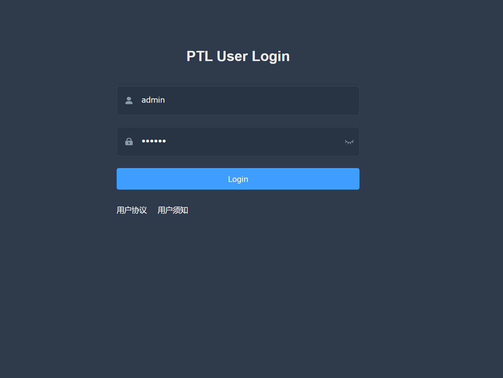
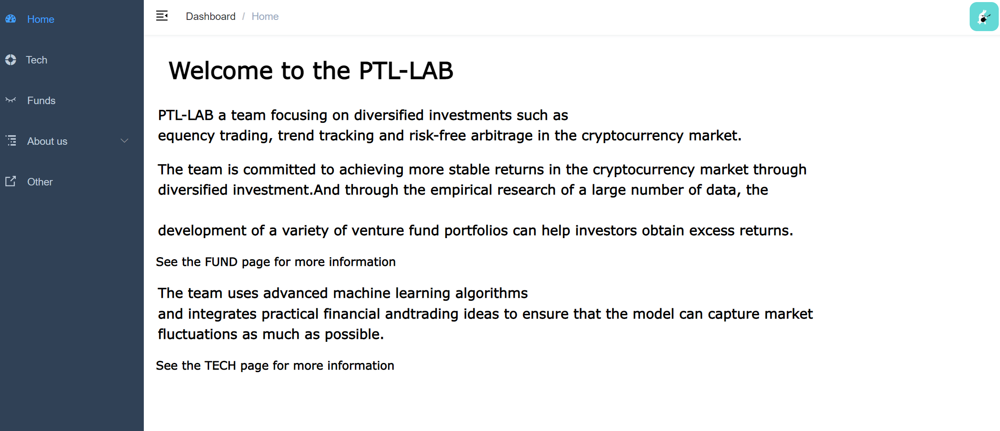
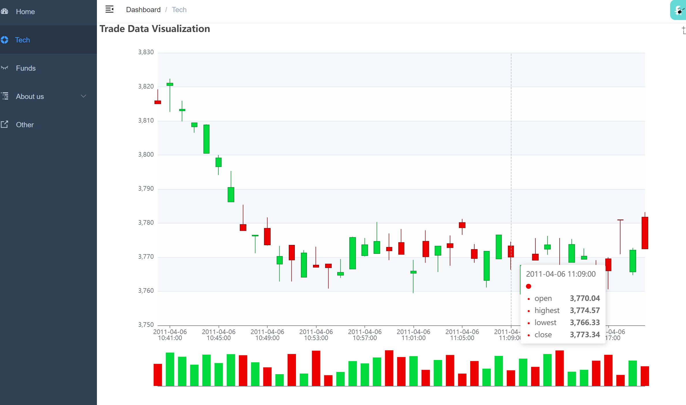
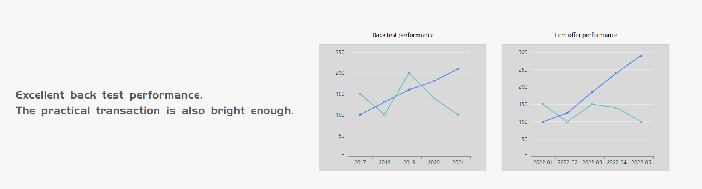
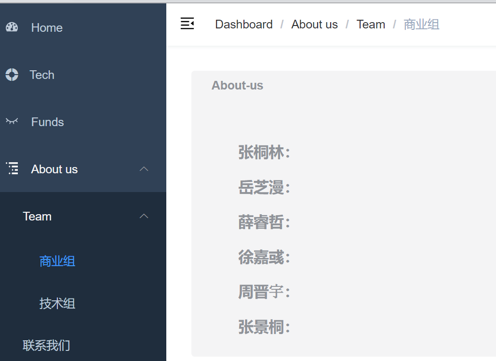

# PTL-lab

项目启动流程

```
# 安装依赖
npm install

# 建议不要直接使用 cnpm 安装以来，会有各种诡异的 bug。可以通过如下操作解决 npm 下载速度慢的问题
npm install --registry=https://registry.npm.taobao.org

# 启动服务
npm run dev
```

## 发布

```
# 构建测试环境
npm run build:stage

# 构建生产环境
npm run build:prod
```


## 项目介绍

## 登陆界面




## Home Page

项目简介：

```
   PTL-LAB a team focusing on diversified investments such as
   equency trading, trend tracking and risk-free arbitrage in the cryptocurrency market.
   The team is committed to achieving more stable returns in the cryptocurrency market through
   diversified investment.And through the empirical research of a large number of data, the

   development of a variety of venture fund portfolios can help investors obtain excess returns.
   See the FUND page for more information
   The team uses advanced machine learning algorithms 
   and integrates practical financial andtrading ideas to ensure that the model can capture market 
   fluctuations as much as possible.
   See the TECH page for more information
```



## Tech

### 订单交易数据可视化



## Funds





# About us



